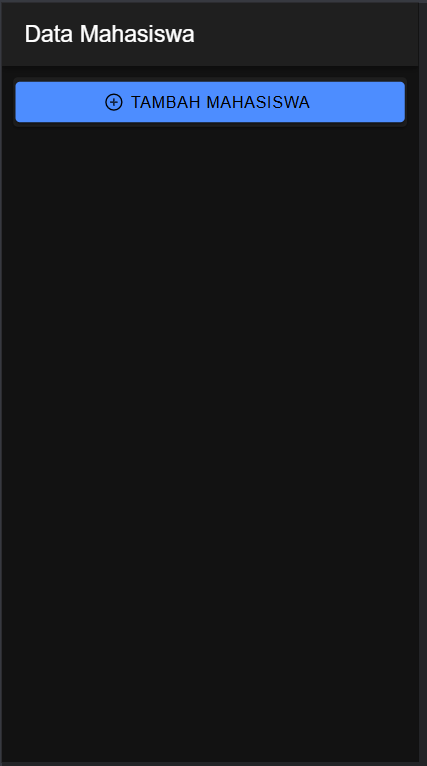
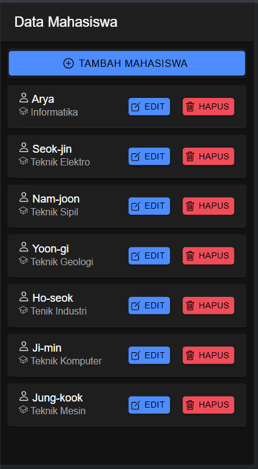
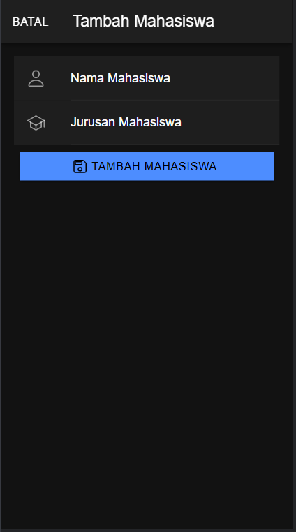
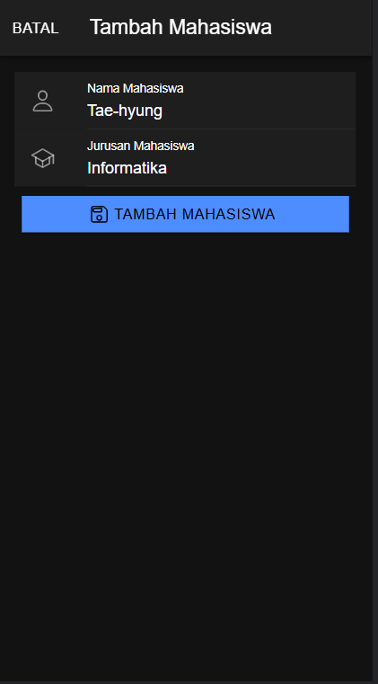
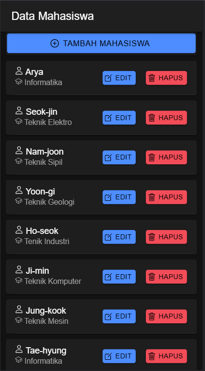
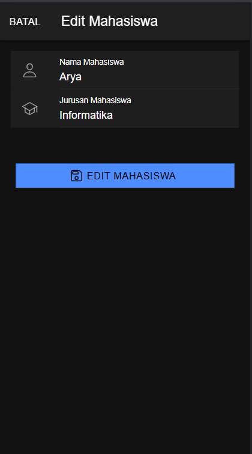
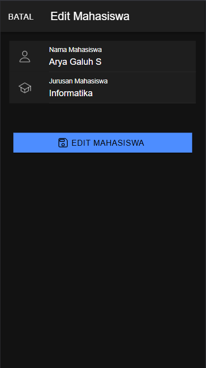
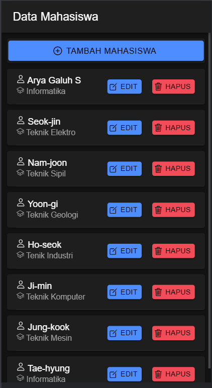
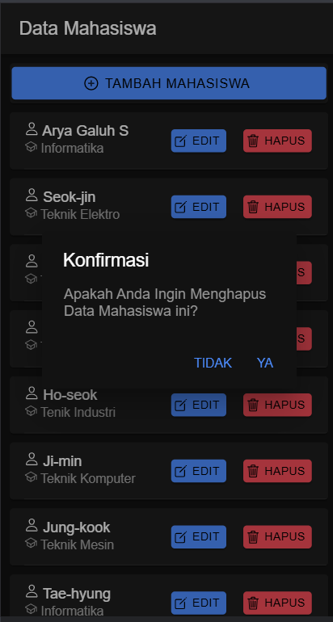
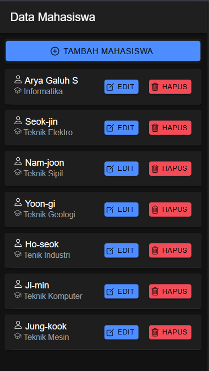

# Tugas 8 - Pertemuan 9

- **Nama** : Arya Galuh Saputra
- **NIM** : H1D022022
- **Shift Lama** : C
- **Shift Baru** : B

## Screenshot & Penjelasan

### 1. Mahasiswa Page (Read)

#### Endpoints
1. Tampil Data
   - URL: `/tampil.php`
   - Method: GET

- Menampilkan daftar mahasiswa dalam bentuk card
- Setiap card menampilkan nama & jurusan mahasiswa
- Terdapat tombol untuk tambah, edit, dan hapus data

### 2. Tambah Data (Create)

#### Endpoints
2. Tambah Data
   - URL: `/tambah.php`
   - Method: POST
   - Data: nama, jurusan

- Modal untuk menambah data mahasiswa baru
- Input nama dan jurusan mahasiswa
- Tombol simpan untuk menyimpan data tambah mahasiswa

### 3. Edit Data (Update)

#### Endpoints
3. Edit Data
   - URL: `/edit.php`
   - Method: PUT
   - Data: id, nama, jurusan

- Modal untuk mengubah data mahasiswa
- Form auto fill dengan data yang akan diedit
- Perubahan akan tersimpan setelah klik tombol edit

### 4. Hapus Data (Delete)

#### Endpoints
4. Hapus Data
   - URL: `/hapus.php`
   - Method: DELETE
   - Parameter: id

- Konfirmasi dialog sebelum hapus data
- terdapat opsi 'Ya' atau 'Tidak'
- Data akan berhasil dihapus ketika mengklik pilihan 'Ya'